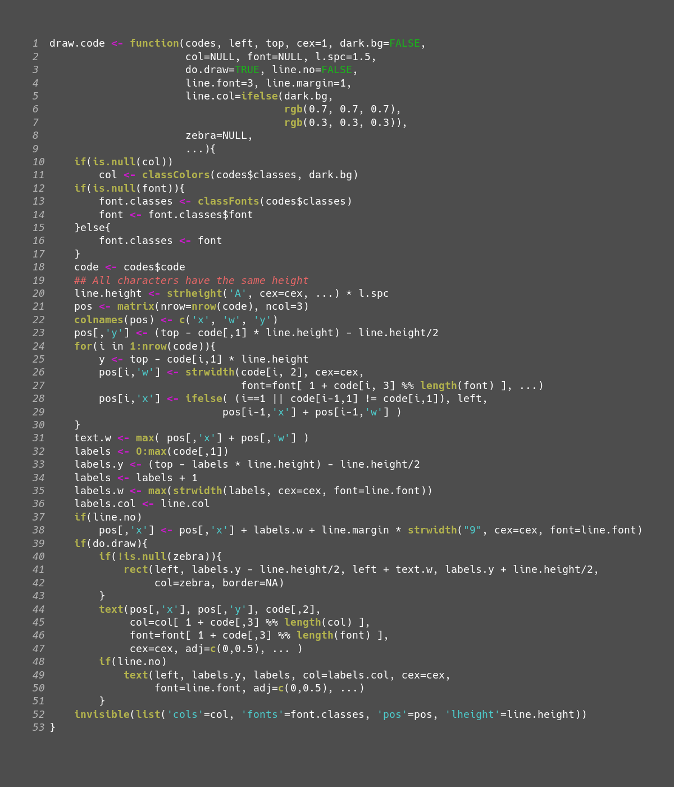

# codeR

Functions to provide syntax highlighting for R code in R
graphics. The software consists of two components:

1. A compiled function `colorise_R(SEXP code)` implemented in
   C. This takes a character vector and returns a list of
   elements specifying code fragments, their line numbers and
   the type of code.
2. A set of R functions:
   1. `coloriseR`. Wraps the compiled function and converts
      output to a dataframe and a character list giving the
      names of classes recognised by `colorise_R`.
   2. `classColors`. Provides a list of suggested colors for
      a dark or light background as a vector that can be supplied
      to the drawing function.
   3. `classFonts`. Provides a suggested vector of font faces
      (plain, bold, ...) for the recognised classes.
   4. `draw.code`. Draws the code with the suggested colors and
      faces.

<figure>
	
	<figcaption>Part of codeR rendered by codeR</figcaption>
</figure>
