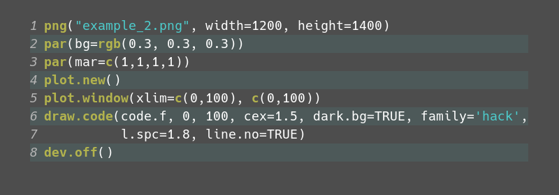

# codeR

Functions to provide syntax highlighting for R code in R
graphics. The software consists of two components:

1. A compiled function `colorise_R(SEXP code)` implemented in
   C. This takes a character vector and returns a list of
   elements specifying code fragments, their line numbers and
   the type of code.
2. A set of R functions:
   1. `coloriseR`. Wraps the compiled function and converts
      output to a dataframe and a character list giving the
      names of classes recognised by `colorise_R`.
   2. `classColors`. Provides a list of suggested colors for
      a dark or light background as a vector that can be supplied
      to the drawing function.
   3. `classFonts`. Provides a suggested vector of font faces
      (plain, bold, ...) for the recognised classes.
   4. `draw.code`. Draws the code with the suggested colors and
      faces.
   5. `draw.code.box`. Draws the code as above but with the character
      expansion adjusted to make the code fit within the rectangle
      provided.

## Motivation, or why anyone might ever use these functions.
I spend a lot of time visualising data in R. Using R low-level
drawing primitives allows me to visualise a wide range of data
types, including such things as gene structures, multiple alignments
and gene synteny. This is both useful and fun; and I have some
ideas about making a presentation explaining how this can be done,
which means that I want to show R-code and the graphics produced
by it. If I was making a document this can be done using R-Markdown,
but I want to make presentations; and because I rather like
the user interface provided by R (i.e. a programmatic one) I
would like to do everything from within R.

So basically this is all in order to not have to use programs
like powerpoint. Of course, this could all be done using latex,
beamer and tikz; but my data analysis is already in R, and in
any case I prefer R to tikz.

### Part of codeR rendered by codeR
<figure>
	
	</figcaption>
</figure>

The commands to produce this rendering:
```R
png("example_2.png", width=1200, height=1400)
par(bg=rgb(0.3, 0.3, 0.3)) 
par(mar=c(1,1,1,1))
plot.new()
plot.window(xlim=c(0,100), c(0,100))
draw.code(code.f, 0, 100, cex=1.5, dark.bg=TRUE, family='hack',
          l.spc=1.8, line.no=TRUE)
dev.off()

```

And the drawing commands above rendered by `codeR`:
<figure>
	
	<figcaption>Code rendered with line numbering and zebra background
	</figcaption>
</figure>
